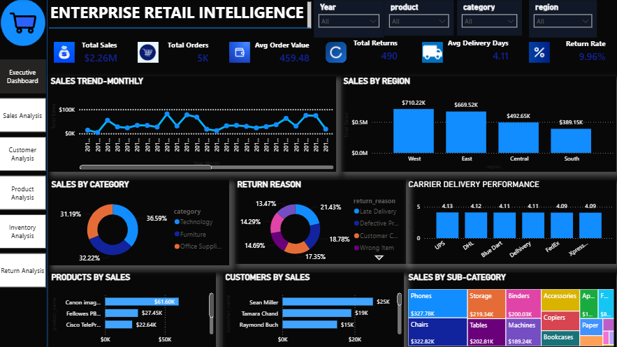
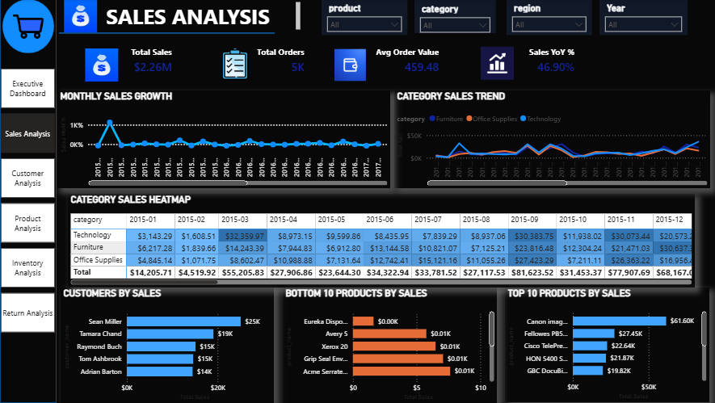
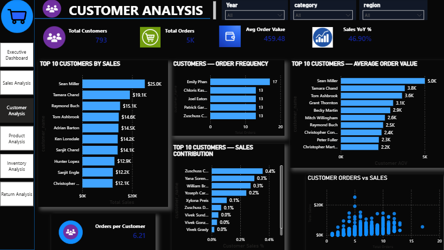
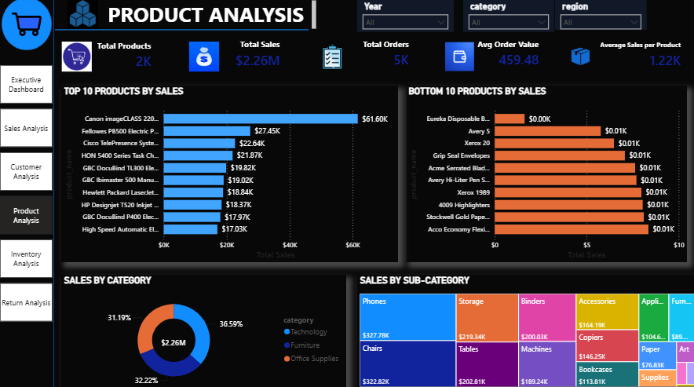
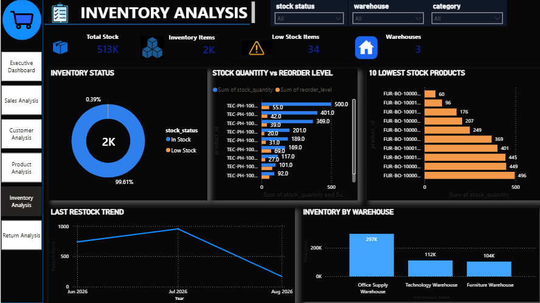
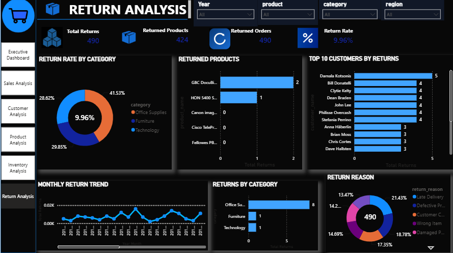

# Enterprise Retail Intelligence Platform

An end-to-end retail analytics project that transforms raw retail data into actionable business insights using Excel, PostgreSQL, SQL, Python, and Power BI.

## Project Overview

The Enterprise Retail Intelligence Platform is designed to analyze retail sales, customer behavior, product performance, inventory, and returns.

The project follows a complete data analytics workflow:

**Raw Data → Excel Cleaning → PostgreSQL Database → SQL Analysis → Python Processing & EDA → Power BI Dashboards → Business Insights**

## Business Problems

This project focuses on answering key retail business questions:

- How are sales performing over time?
- Which products and categories generate the highest sales?
- Which customers contribute the most revenue?
- How frequently do customers place orders?
- Which products require inventory attention?
- How does stock compare with reorder levels?
- Which warehouses hold the highest inventory?
- Which products and categories have the highest return activity?
- What are the major reasons for product returns?
- How do returns change over time?

## Technology Stack

| Technology | Purpose |
|---|---|
| Excel | Data cleaning, validation and initial analysis |
| PostgreSQL | Relational database and data storage |
| SQL | Joins, aggregations, analytical queries and reporting |
| Python | Data processing and automation |
| Pandas | Data manipulation and preprocessing |
| NumPy | Numerical analysis |
| Matplotlib | Data visualization |
| Seaborn | Exploratory data analysis |
| Power BI | Interactive dashboards and business intelligence |

## Power BI Dashboards

The project contains six analytical dashboards:

1. Executive Dashboard
2. Sales Analysis
3. Customer Analysis
4. Product Analysis
5. Inventory Analysis
6. Return Analysis

## Dashboard Preview

### Executive Dashboard



### Sales Analysis



### Customer Analysis



### Product Analysis



### Inventory Analysis



### Return Analysis



## Key KPIs

The Power BI dashboards provide a consolidated view of important retail performance indicators:

- **Total Sales:** $2.26M
- **Total Orders:** 5K
- **Total Returns:** 490
- **Return Rate:** 9.96%
- **Total Inventory Stock:** 513K

These KPIs provide a high-level view of sales performance, order activity, inventory availability, and return behavior.

## Project Workflow

The project follows an end-to-end data analytics workflow:

1. **Data Collection**  
   Raw retail data was collected and organized for analysis.

2. **Data Cleaning & Validation**  
   Excel was used for data inspection, formatting, duplicate checks, missing-value analysis, and validation.

3. **Database Design**  
   PostgreSQL was used to design the relational database structure and organize business entities.

4. **SQL Analysis**  
   SQL was used for joins, aggregations, filtering, analytical queries, KPIs, and reporting.

5. **Python Processing & EDA**  
   Python, Pandas, NumPy, Matplotlib, and Seaborn were used for data processing, exploratory analysis, and visualization.

6. **Power BI Development**  
   Interactive dashboards were created to analyze sales, customers, products, inventory, and returns.

7. **Business Insights**  
   The final dashboards convert analytical results into actionable business insights.

## Data Model

The retail platform is structured around multiple business entities to support scalable analysis.

### Core Entities

- **Orders** — transaction and order-level information
- **Customers** — customer-level information and purchasing behavior
- **Products** — product, category and sub-category information
- **Inventory** — stock quantity, reorder levels and warehouse information
- **Suppliers** — supplier-related information
- **Returns** — returned products and return reasons
- **Payments** — payment-related transaction information
- **Categories** — product classification and hierarchy

The relational database structure was designed in PostgreSQL to support analytical queries and reporting across these business areas.

## Key Insights

The dashboards provide insights across multiple areas of retail operations.

### Sales
- Sales performance can be analyzed across time, categories, sub-categories, and products.
- Top-performing and low-performing products can be identified.
- Sales trends help identify changes in business performance.

### Customers
- Customer purchasing behavior can be analyzed through order frequency and sales contribution.
- High-value customers can be identified for targeted business strategies.

### Products
- Product-level sales performance helps identify high-performing and underperforming products.
- Category and sub-category analysis provides a deeper view of product performance.

### Inventory
- Stock quantity can be compared with reorder levels.
- Warehouse-level inventory distribution helps identify stock concentration.
- Inventory status can support better replenishment decisions.

### Returns
- Return reasons help identify potential product or operational issues.
- High-return products and categories can be identified.
- Return trends provide insight into changes in return behavior over time.


## Project Structure

```text
enterprise-retail-intelligence-platform/
│
├── .gitignore
├── README.md
├── requirements.txt
│
├── .vscode/
│   └── settings.json
│
├── data/
│   ├── cleaned/
│   │   └── superstore_cleaned.xlsx
│   ├── processed/
│   │   └── superstore_cleaned.csv
│   ├── raw/
│   │   └── train.csv
│   └── staging/
│       └── superstore_cleaned.csv
│
├── database/
│   ├── 01_create_database.sql
│   ├── 02_create_tables.sql
│   ├── 03_constraints.sql
│   ├── 04_indexes.sql
│   ├── 05_views.sql
│   ├── 06_functions.sql
│   ├── 07_stored_procedures.sql
│   ├── 08_sample_queries.sql
│   ├── 09_triggers.sql
│   ├── 10_business_reports.sql
│   ├── 11_advanced_queries.sql
│   ├── 12_dashboard_queries.sql
│   ├── 13_performance_optimization.sql
│   ├── README.md
│   │
│   └── etl/
│       ├── 14_load_customers.sql
│       ├── 15_load_products.sql
│       ├── 16_load_orders.sql
│       ├── 17_load_suppliers.sql
│       ├── 18_load_inventory.sql
│       ├── 19_load_transportation.sql
│       ├── 20_load_payments.sql
│       ├── 21_load_returns.sql
│       ├── 22_load_customer_discounts.sql
│       └── 23_run_all_etl.sql
│
├── docs/
│   ├── Business_Requirements.md
│   ├── Database_Design.md
│   ├── Data_Dictionary.md
│   ├── KPI_Definitions.md
│   ├── project_notes.md
│   ├── Project_Requirements.md
│   ├── Project_Roadmap.md
│   │
│   └── screenshots/
│       ├── executive_dashboard.png
│       ├── sales_analysis.png
│       ├── customer_analysis.png
│       ├── product_analysis.png
│       ├── inventory_analysis.png
│       └── return_analysis.png
│
├── excel/
├── image/
├── notebooks/
│
├── powerbi/
│   └── Enterprise_Retail_Dashboard_v2.pbix
│
└── python/
    ├── README.md
    │
    ├── data/
    │   ├── engineered/
    │   │   ├── orders_engineered.csv
    │   │   └── transportation_engineered.csv
    │   │
    │   ├── extracted/
    │   │   ├── customers.csv
    │   │   ├── customer_discounts.csv
    │   │   ├── inventory.csv
    │   │   ├── orders.csv
    │   │   ├── payments.csv
    │   │   ├── products.csv
    │   │   ├── returns.csv
    │   │   ├── suppliers.csv
    │   │   └── transportation_logistics.csv
    │   │
    │   └── processed/
    │       ├── customers.csv
    │       ├── customer_discounts.csv
    │       ├── inventory.csv
    │       ├── orders.csv
    │       ├── orders_engineered.csv
    │       ├── payments.csv
    │       ├── products.csv
    │       ├── returns.csv
    │       ├── superstore_cleaned.csv
    │       ├── suppliers.csv
    │       ├── transportation.csv
    │       └── transportation_engineered.csv
    │
    ├── notebooks/
    │   ├── 01_database_connection.ipynb
    │   ├── 02_data_extraction.ipynb
    │   ├── 03_data_cleaning.ipynb
    │   ├── 04_exploratory_data_analysis.ipynb
    │   ├── 05_feature_engineering.ipynb
    │   └── 06_business_insights.ipynb
    │
    └── scripts/
        ├── create_business_views.py
        ├── database_connection.py
        ├── extract_data.py
        ├── feature_engineering.py
        ├── load_engineered_data.py
        ├── preprocessing.py
        └── utils.py